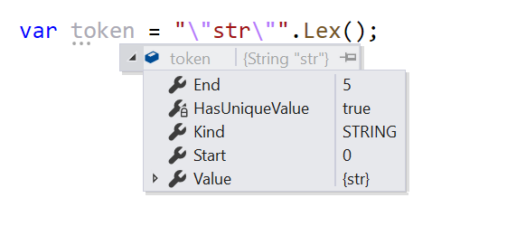

# GraphQL Dotnet Parser

[](https://coveralls.io/github/graphql-dotnet/parser?branch=master)

[](https://www.nuget.org/packages/GraphQL-Parser)
[](https://www.nuget.org/packages/GraphQL-Parser)


[](https://github.com/graphql-dotnet/parser/actions)
[](https://github.com/graphql-dotnet/parser/actions)
[](https://github.com/graphql-dotnet/parser/actions?query=workflow%3A%22%22CodeQL+analysis%22%22)

[](https://lgtm.com/projects/g/graphql-dotnet/parser/alerts/)
[](https://lgtm.com/projects/g/graphql-dotnet/parser/context:csharp)

This library contains a lexer and parser classes as well as the complete GraphQL AST model.

The parser from this library is used in [GraphQL for .NET](https://github.com/graphql-dotnet/graphql-dotnet).

Preview versions of this package are available on [GitHub Packages](https://github.com/orgs/graphql-dotnet/packages?repo_name=parser).

## Lexer
Generates token based on input text.
### Usage
```csharp
var lexer = new Lexer();
var token = lexer.Lex(new Source("\"str\""));
```
Lex method always returns the first token it finds. In this case case the result would look like following.


Also lexer can use the [cache](src/GraphQLParser/Cache/ILexemeCache.cs) to save on memory allocations for named tokens in the managed heap:
```csharp
var cache = new DictionaryCache(); // for single-threaded usage
var cache = new ConcurrentDictionaryCache(); // for multi-threaded usage
var lexer = new Lexer { Cache = cache };           
```
By default the cache is not used. You can find some results of testing with and without the cache in [this file](src/GraphQLParser.Benchmarks/GraphQLParser.Benchmarks.Reference.md).
Keep in mind that the advantages and disadvantages of using the cache appear depending on the specific usage scenario, so it is strongly recommended that you obtain some metrics before
and after using the cache to ensure that you achieve the desired result.

## Parser
Parses provided GraphQL expression into AST (abstract syntax tree).
### Usage
```csharp
var lexer = new Lexer();
var parser = new Parser(lexer);
var ast = parser.Parse(new Source(@"
{
  field
}"));
```
Json representation of the resulting AST would be:
```json
{
	"Definitions": [{
		"Directives": [],
		"Kind": 2,
		"Name": null,
		"Operation": 0,
		"SelectionSet": {
			"Kind": 5,
			"Selections": [{
				"Alias": null,
				"Arguments": [],
				"Directives": [],
				"Kind": 6,
				"Name": {
					"Kind": 0,
					"Value": "field",
					"Location": {
						"End": 50,
						"Start": 31
					}
				},
				"SelectionSet": null,
				"Location": {
					"End": 50,
					"Start": 31
				}
			}],
			"Location": {
				"End": 50,
				"Start": 13
			}
		},
		"VariableDefinitions": null,
		"Location": {
			"End": 50,
			"Start": 13
		}
	}],
	"Kind": 1,
	"Location": {
		"End": 50,
		"Start": 13
	}
}
```
